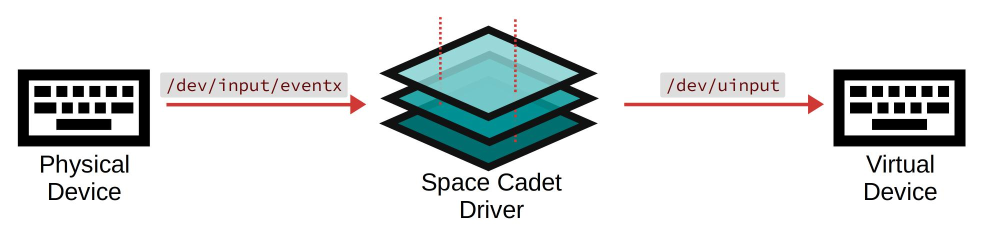

Virtual Space Cadet
===================

This is a virtual keyboard device that supports layers and advanced
key codes (inspired by QMK). The virtual keyboard device runs in user
space - there's no need to modify the kernel. It intercepts events
from an input device, interprets them, and emulates a new virtual
keyboard device. See the
[documentation](https://virtual-space-cadet.readthedocs.io/en/latest/)
for more information.

