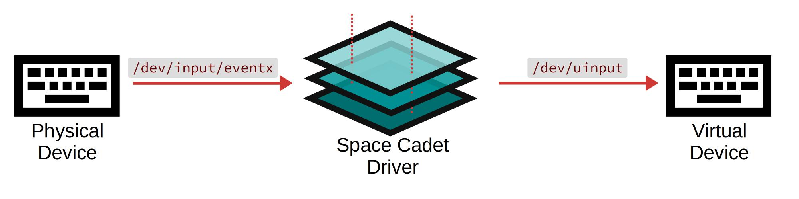

Virtual Space Cadet
===============================================

.. toctree::
   :maxdepth: 2
   :hidden:

   how_it_works
   quickstart
   keys/index
   keyboards/index

This project creates a virtual keyboard device that supports layers and
advanced key codes (inspired by QMK). The virtual keyboard device runs
in user space - there's no need to modify the kernel. It intercepts events
from an input device, interprets them, and emulates a new virtual
keyboard device:

Why does this exist?
--------------------
The keyboard is my primary interface when working on a computer, but
traditional keyboard drivers are painfully limited. I was overjoyed to
discover the *flexibility* that came with running QMK firmware on my
Kinesis Advantage2. However, running QMK for 10 months taught me two
obvious lessons:

1. My laptop's keyboard doesn't support layers.

2. Secure facilities don't like it when you bring a custom keyboard
   to work. [#]_

A laptop keyboard should be a first-class input device, and advanced
capabilities should be available without needing to tweak the kernel.

.. WARNING::
   Treat as a technical proof-of-concept - not something you
   can rely on for a decade. It meets my needs, although it's very
   rough around the edges (first time using Rust...).

Inspiration
-----------

- The `spacefn-evdev <https://github.com/abrasive/spacefn-evdev>`_
  project showed me that it was possible to emulate a keyboard
  layout in user space via ``evdev`` and ``uinput``.

- The `QMK <https://github.com/qmk/qmk_firmware>`_
  project provided inspiration for layers and advanced key codes.

.. [#] We trust keyboards running black-box firmware that was flashed onto
   the device in China, but only if the keyboard has ``$large_manufacturer``
   printed on the box.
